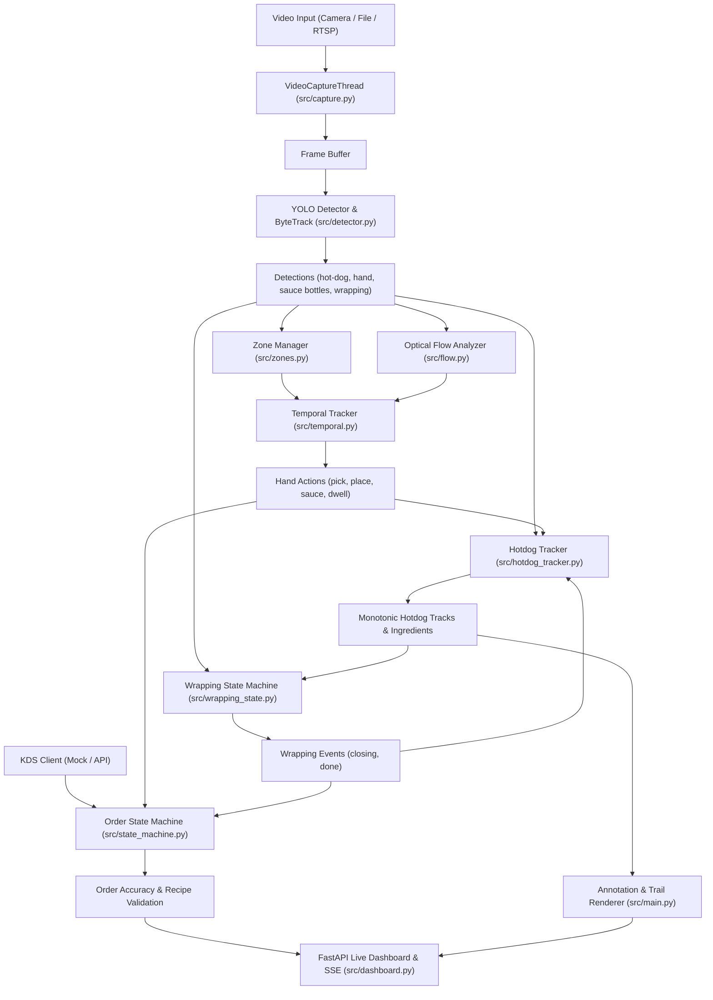
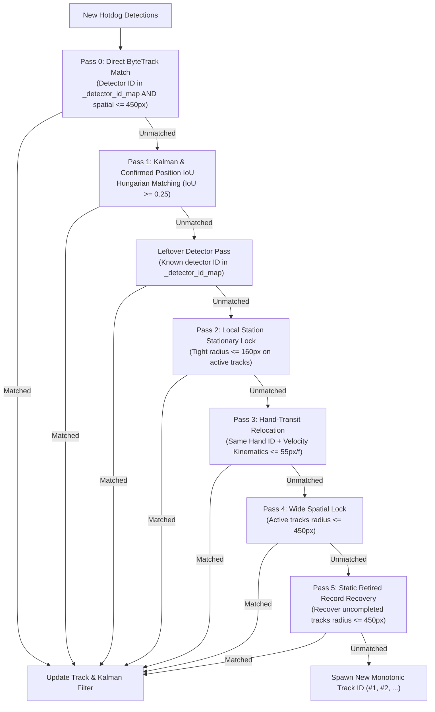

# Order Accuracy Vision & Hotdog Tracking System — Complete System Overview

## 1. System Architecture & High-Level Pipeline

The **Order Accuracy Vision Pipeline** is an end-to-end computer vision and temporal reasoning system designed for quick-service restaurants (specifically Wienerschnitzel). It monitors food assembly in real-time, tracks individual hotdogs with persistent identity across occlusions and hand movements, verifies recipe compliance against Kitchen Display System (KDS) tickets, and detects order completion upon wrapping.



---

## 2. Core Subsystems & Components

### 2.1 Video Ingestion (`src/capture.py`)
- **`VideoCaptureThread`**: Decouples video decoding from downstream inference using a dedicated reader thread and a thread-safe queue (`maxsize=128`).
- **Sources**: Supports local video files (`.mp4`, `.mkv`), RTSP streams, and live webcam hardware.
- **Timestamping**: Tracks video frame index, presentation timestamps ($t = \text{frame} / \text{fps}$), and wall-clock time for accurate cooldowns and dwell calculation.

### 2.2 Neural Object Detection & Primary Tracking (`src/detector.py`)
- **Model**: YOLOv8 / Ultralytics neural network (`rf_trained/weights.pt`).
- **Target Classes**: `hot-dog`, `hand`, `mustard`, `ketchup`, `chili`, `cheese`, `relish`, `wrapping`, `bun`, `towel`.
- **Per-Class Confidence Gating**:
  - `wrapping`: $0.15$ (sensitive to subtle wrapper closing motions).
  - `hot-dog`: $0.10$ (prevents track loss during severe partial occlusion).
  - `hand` & ingredients: $0.50$ (high confidence for action triggering).
- **Internal ByteTrack**: High-speed frame-to-frame box association providing initial raw `track_id` assignments.

### 2.3 Spatial Zoning & Geometry (`src/zones.py`)
- **`ZoneManager`**: Parses polygon definitions from `config/zones.json` and performs fast ray-casting point-in-polygon tests (`cv2.pointPolygonTest`).
- **Zone Categories**:
  - `bin`: Ingredient storage bins (relish, cheese, buns, chili).
  - `assembly`: Main work counter area where hotdogs are dressed and prepped.
  - `sauce_vessel`: Rest zones for condiment squeeze bottles (mustard, ketchup).
  - `wrapping`: Dedicated packaging area where wraps are folded.

### 2.4 Optical Flow Motion Analysis (`src/flow.py`)
- **`OpticalFlowAnalyzer`**: Computes Sparse Lucas-Kanade optical flow on corner features (`cv2.goodFeaturesToTrack`) within hand bounding boxes intersecting ingredient bins.
- **Disambiguation**: Distinguishes true physical dipping/scooping motions from mere hovering or passing-over by analyzing motion vector direction and velocity magnitude.

### 2.5 Temporal Hand Tracking & Action Extraction (`src/temporal.py`)
- **`TemporalTracker`**: Tracks worker hand trajectories and states across time (`idle`, `in_zone`, `picking`, `carrying`, `placing`).
- **Action Generation**:
  - `pick`: Triggered when hand dwells inside an ingredient bin $\ge \text{pick\_dwell\_ms}$ (800ms) with verified optical flow.
  - `place`: Triggered when carrying hand dwells at assembly station $\ge \text{place\_dwell\_ms}$ (500ms).
  - `sauce`: Triggered when condiment bottle moves from rest zone to assembly area or directly overlaps a hotdog.

---

## 3. Hotdog Identity & Lifecycle Management (`src/hotdog_tracker.py`)

The `HotdogTracker` is the central intelligence maintaining persistent hotdog identities, recording ingredients, and handling severe physical occlusions.

```
Hotdog Track Lifecycle:
Spawn (Pass 0/1/4/5) ──► Active (Stationary) ──► Hand Carry (Transit) ──► Re-placement ──► Wrapping (Closing) ──► DONE (Retired)
```

### 3.1 The 5-Pass Matching Cascade

When new detections arrive each frame, the tracker resolves identity through a strict, multi-tiered cascade:



#### Detailed Pass Specifications:
1. **Pass 0 — Direct ByteTrack Match**:
   - Queries `_detector_id_map` for known raw detector track IDs.
   - Verified if $\min(d(\text{det}, \text{pred}), d(\text{det}, \text{rec.bbox})) \le \text{spatial\_lock\_radius}$ ($450\text{px}$) or $\text{IoU} \ge 0.10$.
2. **Pass 1 — Kalman & Confirmed Position IoU**:
   - Computes Hungarian assignment using $\max(\text{IoU}(\text{det}, \text{pred}), \text{IoU}(\text{det}, \text{rec.bbox})) \ge 0.25$.
   - Handles partial bounding box shifts due to ingredients or partial covering.
3. **Pass 2 — Local Station Lock ($\le 160\text{px}$)**:
   - Locks stationary hotdogs resting at counter stations.
   - Prevents static hotdogs from swapping IDs or being hijacked by nearby movements.
4. **Pass 3 — Hand-Transit In-Flight Relocation (Kinematically Bounded)**:
   - When a worker picks up and carries a hotdog (causing it to disappear under hands), the tracker stores `_last_lost_by_hand[hand_id] = {tid, lost_frame, lost_pos}`.
   - When placed down, **only the hand that picked it up** can relocate that specific ID.
   - Governed by physical kinematic displacement bound:
     $$\text{displacement} \le \text{base\_hand\_displacement\_px} (300\text{px}) + \text{elapsed\_frames} \times \text{max\_hand\_speed\_px\_per\_frame} (55\text{px/frame})$$
5. **Pass 4 — Wide Spatial Lock ($\le 450\text{px}$)**:
   - Catches active coasting hotdogs within the station area.
6. **Pass 5 — Static Occlusion Recovery**:
   - Recovers hotdogs occluded in place (under paper, boxes, or sauce bottles) from `_retired_records` within `orphan_timeout_s`.

### 3.2 Dual-Anchor Kalman Drift Resistance
To eliminate Kalman filter velocity drift during coasting or hand occlusions, all spatial passes compute Euclidean centroid distance against **both** the Kalman extrapolated box and the last confirmed physical resting bounding box:
$$d_{\text{spatial}} = \min\left(\|\mathbf{c}_{\text{det}} - \mathbf{c}_{\text{pred}}\|_2, \; \|\mathbf{c}_{\text{det}} - \mathbf{c}_{\text{confirmed}}\|_2\right)$$

---

## 4. Wrapping State Machine (`src/wrapping_state.py`)

Tracks the final packaging lifecycle of each hotdog:
1. **`TRACKING`**: Hotdog is active on the assembly counter.
2. **`CLOSING`**: Triggered when a `wrapping` detection overlaps the hotdog bounding box for $\ge \text{wrapping\_dwell\_s}$ ($0.1\text{s}$). Emits `"about_to_complete"` dashboard alert.
3. **`DONE`**: Triggered after the hotdog bounding box disappears from view for $\ge \text{wrapping\_done\_delay\_s}$ ($1.0\text{s}$) or $\ge 30$ consecutive closing frames.
4. **Permanent Done Register**: Completed track IDs are added to `_permanent_done_ids`, preventing completed hotdogs from re-spawning or being matched to subsequent food items.

---

## 5. Order Validation & POS / KDS Fusion (`src/state_machine.py`)

- **`OrderStateMachine`**:
  - Listens to ticket events from KDS (`MockKDSClient` or real-time POS API).
  - Associates physical hotdogs with expected order ticket items (`Chili Dog`, `Mustard Dog`, `Cheese Dog`).
  - Validates added ingredients against ticket recipe definitions.
  - Generates accuracy metrics (`passed_orders`, `failed_orders`, `accuracy_pct`, `error_rate_pct`).
- **POS / Vision Mismatch Alert**:
  - Emits real-time alerts if active vision tracks exceed the expected ticket count.

---

## 6. Visualization & Live Dashboard (`src/main.py`, `src/dashboard.py`)

- **Live Video Streaming**: Annotated OpenCV frames encoded to JPEG and streamed via Server-Sent Events (SSE) / multipart HTTP stream to the web UI at `http://localhost:8000`.
- **Annotation Renderer (`draw_annotations`)**:
  - **Clean Header Badges**: Compact `#1`, `#2` badges displayed on hotdogs without cluttered text.
  - **Monotonic ID Resolution**: Always queries `_detector_id_map` first, ensuring labels never flip or display internal ByteTrack IDs.
  - **Fading Trajectory Trails**: Renders color-coded past motion trails with a 10-second alpha decay upon disappearance.
  - **Zone Polygons & Status Overlays**: Displays active station boundaries, "About to Complete" warnings, and "Order Done" completion banners.

---

## 7. Configuration Reference

### Key Parameters in `config/tracker.yaml` & `config/model.yaml`:

| Parameter | Location | Default | Purpose |
| :--- | :--- | :--- | :--- |
| `spatial_lock_radius` | `tracker.yaml:wrap_station` | `450.0` px | Maximum radius for wide spatial matching and static recovery |
| `occlusion_buffer_s` | `tracker.yaml:wrap_station` | `20.0` s | Extended coasting window for hotdogs in assembly area |
| `stall_watchdog_window_s`| `tracker.yaml:wrap_station` | `20.0` s | Timeout to detect stalled hotdogs |
| `max_hand_speed_px_per_frame`| `tracker.yaml:wrap_station`| `55.0` px/f | Maximum physical hand transit speed for Pass 3 relocation |
| `base_hand_displacement_px` | `tracker.yaml:wrap_station`| `300.0` px | Base allowable hand displacement radius for hand pickup/drop |
| `hand_lost_timeout_frames` | `tracker.yaml:wrap_station`| `180` frames | Max duration (6.0s at 30fps) a hand can carry an occluded item |
| `wrapping_conf_threshold` | `model.yaml` | `0.15` | YOLO threshold override for wrapping paper class |
| `hotdog_conf_threshold` | `model.yaml` | `0.10` | YOLO threshold override for hot-dog class |
| `pick_dwell_ms` | `model.yaml` | `800` ms | Required hand dwell in bin to register ingredient pick |
| `place_dwell_ms` | `model.yaml` | `500` ms | Required hand dwell at station to register ingredient place |

---

## 8. Directory & File Structure

```
Internal/
├── config/
│   ├── model.yaml              # Model paths, confidence thresholds, dwell times
│   ├── tracker.yaml            # HotdogTracker, optical flow, trail, & wrap settings
│   └── zones.json              # Polygon definitions for bins, assembly, & vessels
├── rf_trained/
│   └── weights.pt              # Trained YOLO neural network weights
├── src/
│   ├── capture.py              # Threaded video capture
│   ├── dashboard.py            # FastAPI dashboard & SSE event streamer
│   ├── detector.py             # YOLO detector & ByteTrack integration
│   ├── flow.py                 # Sparse Lucas-Kanade optical flow analyzer
│   ├── hotdog_tracker.py       # 5-pass matching, hand-transit kinematics, monotonic IDs
│   ├── kds_client.py           # KDS ticket client (Mock & Dynamic)
│   ├── main.py                 # Pipeline orchestrator, visualization, metrics loop
│   ├── schemas.py              # Data structures (Detection, Action, Order, Zone)
│   ├── state_machine.py        # Order recipe validation & accuracy metrics
│   ├── temporal.py             # Hand state tracking & action extraction
│   ├── wrapping_state.py       # Wrapping state machine & completion detector
│   └── zones.py                # Polygon zone manager & geometric queries
├── tests/                      # 114 automated pytest unit & integration tests
├── run_10min_video.py          # Runner for 10-minute production test video
├── run_full_video.py           # Runner for 1-hour full camera video
├── run_video.py                # Generic video runner
└── SYSTEM_OVERVIEW.md          # System documentation (this file)
```

---

## 9. Verification & Execution

### Running the Test Suite:
```powershell
pytest tests/test_wrap_station_occlusion.py tests/test_hotdog_tracker.py tests/test_state_transitions.py tests/test_trail.py tests/test_flow.py tests/test_wrapping_state.py tests/test_zones.py
```
*Current Status: 114 / 114 tests passing (100% pass rate).*

### Running Video Pipeline:
```powershell
python run_10min_video.py
```
*Live dashboard available at `http://localhost:8000`.*
